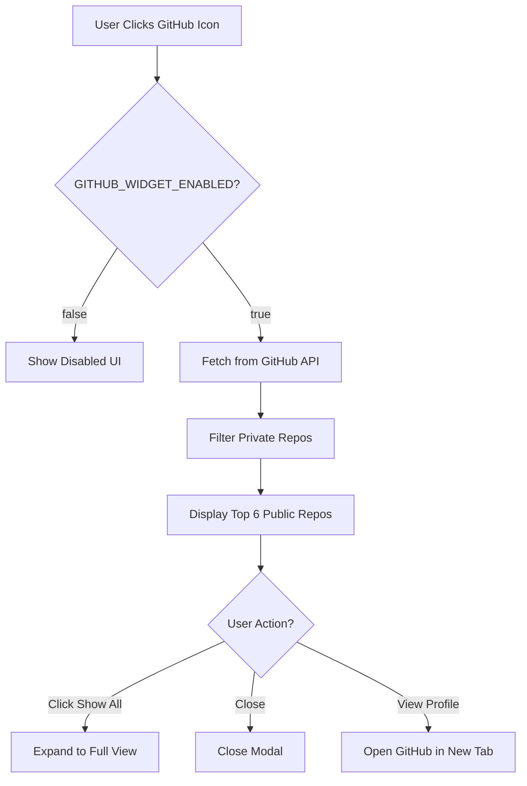
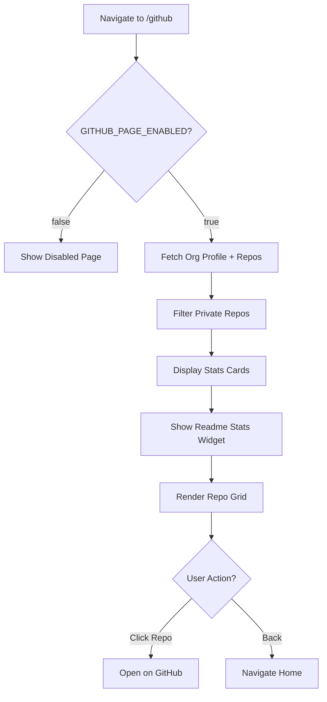

# GitHub Widget - Architecture & Flow Diagrams

## 🏗️ System Architecture

```
┌─────────────────────────────────────────────────────────────┐
│                    ProjectHub Application                     │
└─────────────────────────────────────────────────────────────┘
                              │
        ┌─────────────────────┴─────────────────────┐
        │                                           │
┌───────▼────────┐                         ┌────────▼────────┐
│  Hero Section  │                         │   /github Route │
│                │                         │                 │
│  [GitHub Icon] │                         │   GithubPage    │
└───────┬────────┘                         └────────▲────────┘
        │                                           │
        │  onClick()                                │
        ▼                                           │
┌───────────────────┐                               │
│ GithubWidget      │                               │
│ (Modal Overlay)   │◄──────────────────────────────┘
└───────────────────┘
        │
        │ Both components share:
        ├─ GITHUB_XXX_ENABLED constant
        ├─ Private repo filtering
        └─ GitHub API integration
```

---

## 🔄 Component Lifecycle Flow

### Widget Modal Flow



### Page Flow



---

## 🔐 Privacy Filter Flow

```
GitHub API Response
[Repo1, Repo2, Repo3, ..., RepoN]
         │
         ▼
    .filter(repo => !repo.private)
         │
         ▼
    [Public Repo1, Public Repo3, ...]
         │
         ▼
    Widget: .slice(0, 6)
    Page: Use all
         │
         ▼
    Render UI (Private repos excluded)
```

---

## ⚙️ Configuration Control Flow

```
Application Start
         │
         ▼
  Load Components
         │
    ┌────┴────┐
    │         │
    ▼         ▼
Widget.tsx  Page.tsx
    │         │
    ▼         ▼
Check:      Check:
GITHUB_     GITHUB_
WIDGET_     PAGE_
ENABLED     ENABLED
    │         │
    ▼         ▼
 true/false  true/false
    │         │
    ▼         ▼
 Enable/     Enable/
 Disable     Disable
```

---

## 📊 Data Flow Diagram

```
┌──────────────────┐
│  GitHub API      │
│  api.github.com  │
└────────┬─────────┘
         │ GET /orgs/ProjectHub-fie/repos
         ▼
┌──────────────────┐
│  Fetch Response  │
│  (50 repos max)  │
└────────┬─────────┘
         │
         ▼
┌──────────────────┐
│  Filter Logic    │
│  !repo.private   │
└────────┬─────────┘
         │
         ▼
┌──────────────────┐
│  Public Repos    │
│  (filtered list) │
└────────┬─────────┘
         │
    ┌────┴────┐
    │         │
    ▼         ▼
┌─────────┐ ┌──────────┐
│ Widget  │ │  Page    │
│ (top 6) │ │ (all)    │
└────┬────┘ └────┬─────┘
     │           │
     ▼           ▼
┌─────────────────────┐
│   User Interface    │
│  - Stats Widget     │
│  - Repo Cards       │
│  - Action Buttons   │
└─────────────────────┘
```

---

## 🎨 UI State Machine

```
         ┌─────────────┐
         │   Initial   │
         └──────┬──────┘
                │
                ▼
         ┌─────────────┐
         │   Loading   │──error──► ┌─────────┐
         └──────┬──────┘           │  Error  │
                │                  └─────────┘
                │ success
                ▼
    ┌───────────────────────┐
    │   Check Enabled?      │
    └───────┬───────┬───────┘
            │       │
          false   true
            │       │
            ▼       ▼
    ┌────────────┐ ┌──────────────┐
    │  Disabled  │ │  Success     │
    │   State    │ │  Display     │
    └────────────┘ └──────┬───────┘
                          │
                    ┌─────┴─────┐
                    │           │
                    ▼           ▼
             ┌──────────┐ ┌──────────┐
             │ Compact  │ │  Full    │
             │  View    │ │  View    │
             └──────────┘ └──────────┘
```

---

## 📁 File Dependencies

```
App.tsx
  │
  ├──► hero-section.tsx
  │     │
  │     └──► github-widget.tsx
  │           │
  │           ├──► @/components/ui/card
  │           ├──► @/components/ui/button
  │           └──► lucide-react (icons)
  │
  └──► pages/github.tsx
        │
        ├──► @/components/ui/card
        ├──► @/components/ui/button
        └──► lucide-react (icons)
```

---

## 🔧 Configuration Matrix

| Scenario | Widget Enabled | Page Enabled | Result |
|----------|---------------|--------------|---------|
| **Full Feature** | `true` | `true` | ✅ Widget shows repos, Page accessible |
| **Widget Only** | `true` | `false` | ✅ Widget shows repos, Page disabled |
| **Page Only** | `false` | `true` | ✅ Widget disabled, Page shows repos |
| **Disabled** | `false` | `false` | ⛔ Both show disabled state |

---

## 🚀 Build & Deploy Flow

```
Development
    │
    ├─► Edit Config Constants
    │
    ├─► npm run build
    │
    ├─► TypeScript Compilation
    │     │
    │     ├─✓ Success → Continue
    │     └─✗ Error → Fix code
    │
    ├─► Vite Bundle
    │
    └─► Output: /dist/public/
          │
          ├─ assets/github-*.js (Widget component)
          ├─ assets/github-*.css (Styles)
          └─ index.html (Entry point)
                │
                ▼
          Production Deploy
```

---

## 🎯 Key Integration Points

### 1. Hero Section Integration
```typescript
// In hero-section.tsx
<button onClick={() => setShowGithubWidget(true)}>
  <Github />
</button>

{showGithubWidget && (
  <GithubWidget onClose={() => setShowGithubWidget(false)} />
)}
```

### 2. App Routing Integration
```typescript
// In App.tsx
const GithubPage = React.lazy(() => import("@/pages/github"));

<Route path="/github" component={GithubPage} />
```

### 3. GitHub API Integration
```typescript
// Organization endpoint
fetch(`https://api.github.com/orgs/${username}/repos`)

// Includes 'private' field for filtering
```

---

## 📈 Performance Considerations

```
API Call Strategy:
┌────────────────────────────────────┐
│ Widget: Fetch 20 → Filter → Take 6 │
│ Page: Fetch 50 → Filter → Show All │
└────────────────────────────────────┘

Benefits:
- Minimizes API calls (single request)
- Client-side filtering (fast)
- Reduces bundle size (no extra libraries)
- No server-side processing needed
```

---

## 🎨 Responsive Design Flow

```
Mobile (< 768px)
    │
    ├─ Widget: Single column
    ├─ Page: 1 column grid
    └─ Stats: Stacked cards
    
Tablet (768px - 1024px)
    │
    ├─ Widget: Optimized layout
    ├─ Page: 2 column grid
    └─ Stats: 2x2 grid
    
Desktop (> 1024px)
    │
    ├─ Widget: Full multi-column
    ├─ Page: 3 column grid
    └─ Stats: 4 column row
```

---

**Last Updated**: March 6, 2026  
**Version**: 2.0  
**Status**: ✅ Production Ready
